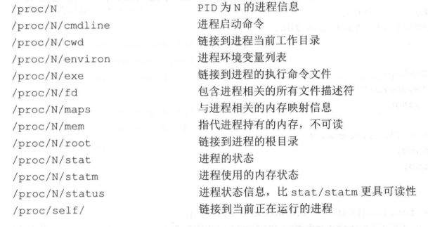

# myDocker

## 1 Namespace隔离

### 调用外部命令

`os/exec`包下的方法实现了执行外部命令并与外部命令进行交互。
`cmd = exec.Command()`设置命令行参数，返回命令行对象cmd，最后调用`cmd.Run()`执行命令。
`os.Args`程序获取运行他时给出的参数
cmd命令包含输入和输出字段，可以设置这些字段，实现定制输入输出。
`cmd.Stdin/cmd.Stdout/cmd.Stderr`

syscall.SysProcAttr保管可选的、各操作系统特定的sys执行属性。

## 2 Cgroups

linux为每个sybsystem创建一个层级结构，docker就是在每个层级结构中创建一个cgroup，
将进程加入到cgroup中，也就是每个层级结构中。


## 3 AUFS

Docker利用AUFS存储image。 image是由一系列的read-only的layer组成的。

宿主机的`/var/lib/docker/aufs/layers`目录存储着image layers如何堆栈这些layer
的metadata，其实里面每个文件对应了每一层，文件记录了自己的祖先镜像层次。

而`/var/lib/docker/aufs/diff`目录记录了每一层(每个子镜像)存储的真实文件和目录。

运行中的容器映射在`/var/lib/docker/aufs/mnt/`下，这是aufs给容器和其下层layer
的一个mount point。如果容器没有运行了，这个目录下为空

container的metadata和配置文件都存放在`/var/lib/docker/containers/<container-id>/`下。


在启动container的时候，Docker还会为其创建一个read-write的init layer，
用来存储与这个容器内环境相关的内容；然后再创建一个read-write的layer来执行
所有写操作。

如果要删除container的一个文件，例如file1，aufs会在container的read-write层生成
一个.wh.file1的文件来隐藏所有read-only层的file1文件。


### 一个COW实验

在实验目录test/下创建一个aufs文件夹，然后在aufs文件夹中创建一个mnt文件夹作为挂载点，
然后再在aufs文件夹中创建5个文件夹，并在这5个文件夹中分别创建一个文件，分别是：
```
test/aufs/container-layer/container-layer.txt
test/aufs/image-layer1/image-layer1.txt
test/aufs/image-layer2/image-layer2.txt
test/aufs/image-layer3/image-layer3.txt
test/aufs/image-layer4/image-layer4.txt
```
然后在这5个文件中写入"container-layer"、"image-layer1"、"image-layer2"、"image-layer3"、"image-layer4"
的文本内容，现在模仿docker运行container时将image的每一个层次和最上层的可读写层挂在到mnt下，

```bash
sudo mount -t aufs -o dirs=./container-layer:./image-layer4:./image-layer3:./image-layer4:./image-layer1 none ./mnt
```

然后linux会在`/sys/fs/aufs/`下创建一个文件夹，假设是`si_fe42d38e1e89`，
然后`cat /sys/fs/aufs/si_fe42d38e1e89/*`
```
/home/test/aufs/container-layer=rw
/home/test/aufs/image-layer4=ro
/home/test/aufs/image-layer3=ro
/home/test/aufs/image-layer2=ro
/home/test/aufs/image-layer1=ro
64
65
66
67
68
```
接下来在mnt/image-layer4.txt中添加一段文字`write to mn's image-layer1.txt`

根据COW技术，`cat ./mnt/image-layer4.txt`：
```
image-layer4
write to mn's image-layer1.txt
```

但查看image-layer4/image-layer4.txt文件的内容，发现其并为改变。

但检查container-layer下多了一个名为image-layer4.txt的文件，文件的内容为：
```
image-layer4
write to mn's image-layer1.txt
```

也就是说，当尝试向mnt/image-layer4.txt文件进行写操作的时候，系统首先在mnt目录下
查找名为image-layer.txt的文件，将其拷贝到read-write层的container-layer目录中，
接着对container-layer目录中的image-layer4.txt文件进行写操作。

我理解的是docker把所有layer都挂载到mnt下，然后容器内（也就是最上层的container-layer）就能看到所有祖先层中的文件，
当在容器中对祖先层中的文件进行修改时，首先将祖先层中待修改的文件复制到最上层container-layer中，再进行修改，祖先层中的文件
并未修改。
也就是在修改祖先层文件之前是不对祖先层中的文件进行复制的，当进行修改时，在进行复制修改操作。


## 4 实现docker run命令

### 4.1 /proc文件系统

/proc文件系统是由内核提供，是一个虚拟文件系统，包含了系统运行时的信息，例如
系统内存、mount设备信息、一些硬件配置等。它只存在于内存中，而不占用外村空间。
为用户程序访问内核数据提供接口。实际上很多命令都是简单去读取该文件系统中的某个
文件内容。

这个目录下保存很多数字，这都是每个进行创建的空间，数字就是进程的pid。
而在每个进程的目录下又包含了许多关于进程信息的文件。



### 实现docker run -it [command]命令

